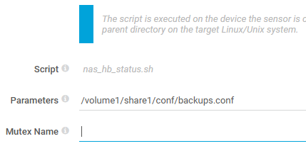
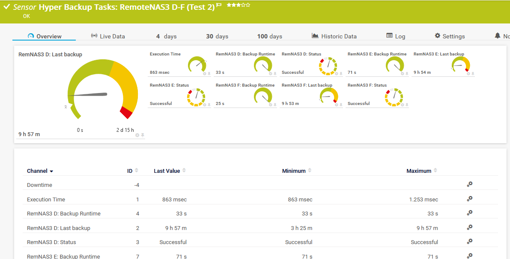

# nas_hb_status

Bash script for PRTG by Paessler to monitoring status of backup with Synology's Hyper Backup

The sensor will show the status of the backups, integrity, time passed since the last backup & integrity check, size and changed size of data. The data is collected from */var/log/synolog/synobackup.log* & */var/log/messages*.

Sensor has to be created in PRTG on your Synology device.

Sensor tested on DS 925+ with DSM 7.3 and newer / Hyper Backup 4.1 and newer and Cloud Backup (Hetzner Storage Box) and Remote NAS backup to Hyper Backup Vault to DSM 7.3. Should work with older verions, too.

**Note:** This script works best with the versioned backup. But for those of you who uses the single version backup or don't want the whole statistical data, I've created "nas_hb_status_state.sh". It uses the same config file, but needs only the "prtg.standardlookups.nas.hbstatus.ovl" lookup file.

### Prerequisites

Be sure you have set correct logon values for SSH in your device.

I personally use "Login via private key" with an user especially for monitoring which also may use sudo for this script without a password.


**HINT:** Since DSM 6.2.2 for SSH access the user has to be member of the local administrators group on your Synology NAS.

**Hint:** In order for users to be able to do sudo without a password, the following line must be added to /etc/sudoers: ```%administrators ALL = NOPASSWD: ALL```

### Installing

Place the script to /var/prtg/scriptsxml on your Synology NAS and make it executable. (You may have to create this directory structure because PRTG expects the script here.)

```
wget https://raw.githubusercontent.com/WAdama/nas_hb_status/master/nas_hb_status.sh
chmod +x nas_hb_status.sh
```

On your PRTG system place the files prtg.standardlookups.nas.hbstatus.ovl and prtg.standardlookups.nas.hbintstatus.ovl in *INSTALLDIR\PRTG Network Monitor\lookups\custom* and refresh it under **System Administration / Administrative Tools**

In PRTG create under your device which represents your Synology a SSH custom advanced senor.

Choose under "Script" this script and enter under "Parameters" the name and path of your configuration file.



For the sensor create a conf file in the chosen path.

The configuration file must contain the following entries according to your backup tasks in JSON format:

```
{
  "tasks": [
    "Backup - No1",
    "Backup - No2",
    "Backup - No3"
    ]
}
```
This script will set default values for limits in *Last backup* channel:

Upper warning limit: 36 h (129600 s)

Upper error limit: 60 h (216000 s)

and *Last integrity check*:

Upper warning limit: 7 d 1 h (608400 s)

Upper error limit: 8 d 1h (694800 s)

**Hint:** If you created your sensor with an earlier version please create it new when you use the actual version. I've changed the name for channel *Time passed* to *Last backup*


nas_hb_status_state.sh:

